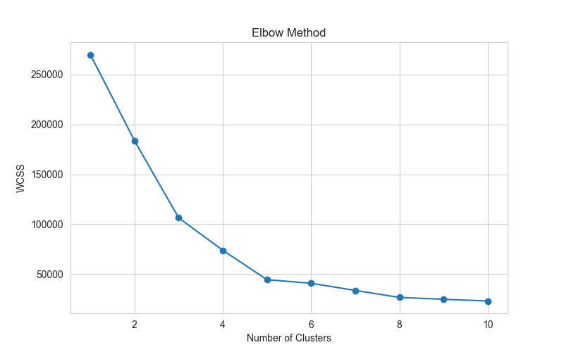
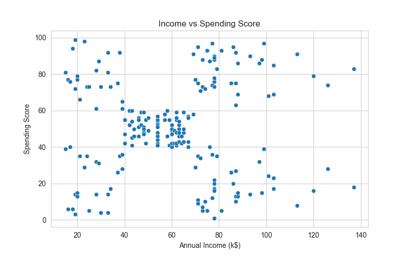
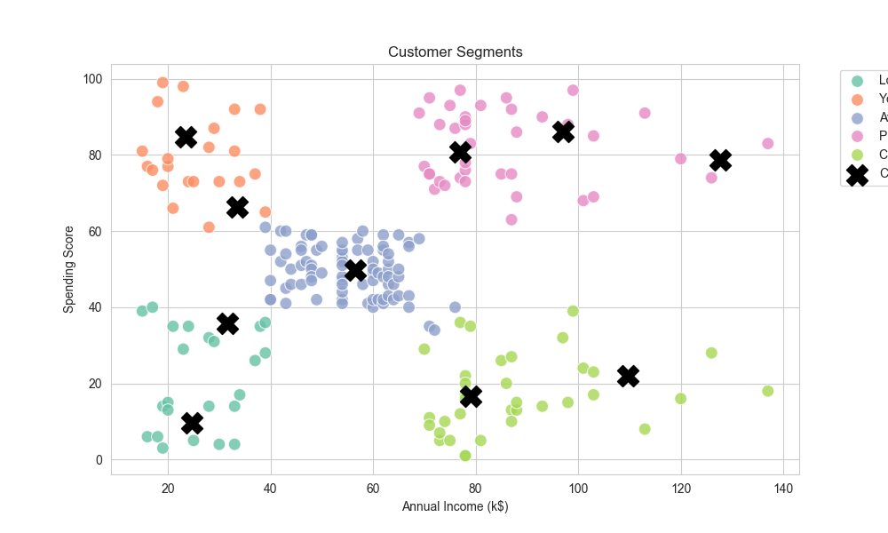

# Customer Segmentation Analysis with Python


## Project Overview

This project analyzes mall customer behavior using Exploratory Data Analysis (EDA) and KMeans Clustering techniques.

The objective of this project is to identify customer segments based on annual income and spending behavior, helping businesses better understand customer characteristics and improve marketing strategies.

### Business Value

This project demonstrates how customer segmentation can help businesses:
- Improve targeted marketing campaigns
- Identify high-value customers
- Optimize promotional strategies
- Increase customer retention through behavioral analysis

---

## Business Problem

Businesses often struggle to understand different customer behaviors and spending patterns.

Without customer segmentation:
- Marketing campaigns become less targeted
- Customer retention strategies become inefficient
- High-value customers may not be properly identified

This project helps identify distinct customer groups for better business decision-making.

---

## Project Objectives

- Perform Exploratory Data Analysis (EDA)
- Analyze customer income and spending behavior
- Apply KMeans Clustering for customer segmentation
- Identify high-value customer groups
- Generate business insights from clustering results

---

## Tools & Libraries

- Python
- Pandas
- NumPy
- Matplotlib
- Seaborn
- Scikit-learn
- Jupyter Notebook
- VS Code
- GitHub

---

## Dataset Information

Dataset contains mall customer information including:
- Customer ID
- Gender
- Age
- Annual Income (k$)
- Spending Score (1-100)

---

## Project Workflow

1. Data Loading
2. Data Understanding
3. Data Cleaning
4. Exploratory Data Analysis
5. Customer Segmentation
6. KMeans Clustering
7. Data Visualization
8. Business Insight Generation

---

## Key Insights

- Most customers belong to the middle-income and moderate-spending segment.
- Premium customers with high income and high spending represent the most valuable target market.
- Some high-income customers demonstrate low spending behavior, indicating potential upselling opportunities.
- Customer segmentation helps businesses improve personalized marketing strategies.

---

## Visualizations

### Elbow Method



### Income vs Spending Score



### Customer Segments



---

## Project Structure

```bash
customer-segmentation-python/
│
├── data/
│   ├── customer_data.csv
│
├── notebook/
│   └── customer_segmentation.ipynb
│
├── output/
│   ├── customer_segments.csv
│   ├── customer_segments.png
│   ├── elbow_method.png
│   └── income_vs_spending.png
│
└── README.md
```

---

## Final Conclusion

KMeans clustering successfully identified five distinct customer groups based on annual income and spending score.

This analysis can help businesses:
- Improve targeted marketing campaigns
- Increase customer retention
- Identify premium customer segments
- Optimize business strategies using customer behavior analysis

---

## Future Improvements

Possible future enhancements for this project:
- Add interactive dashboard using Power BI or Tableau
- Deploy clustering visualization using Streamlit
- Apply additional clustering techniques such as DBSCAN or Hierarchical Clustering
- Perform customer behavior prediction using Machine Learning

## Author

Ahmad Iqbal Maulana

- LinkedIn: https://www.linkedin.com/in/ahmad-iqbal-maulana-9669b8228
- GitHub: https://github.com/yourvaiqbal